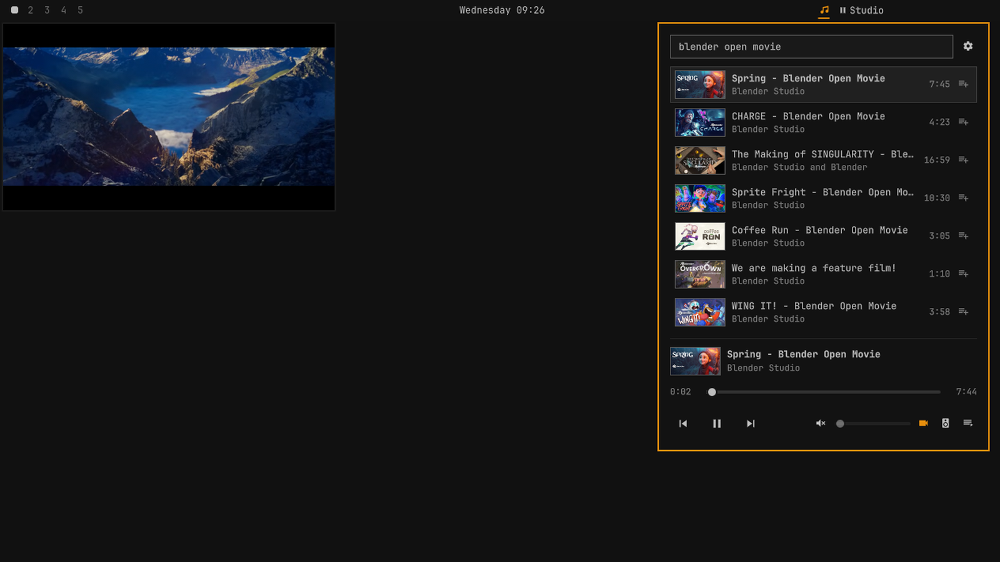

# OmaJuke

OmaJuke plays YouTube from the Omarchy bar. Click its icon, type a search, press Enter and pick a
result: the audio plays through mpv and keeps playing after the panel is closed. No browser is
opened and no account is needed.



This is version 0.2.2. What it does:

- Searches YouTube and lists up to 20 results with thumbnails.
- Plays a result, or a YouTube video link pasted into the search field.
- Keeps a queue of up to 200 tracks and, with `autoplay` on, goes on with related tracks when the
  queue runs out.
- Pauses, resumes, seeks, goes to the next and the previous track, changes the volume and mutes:
  from the panel, from the bar icon, from a command line and, with `mpv-mpris`, from the media
  keys.
- Shows the video of the playing track in a small window in a corner of the screen, when you ask
  for it. Without that window only the audio is fetched.
- Offers three keyboard shortcuts that work anywhere on the desktop. None is assigned until you
  assign it.
- Sends its sound to the audio output you choose, without changing the system default.
- Remembers up to 30 recently played tracks and the queue. You can switch that off and clear both.

Two things are off until you switch them on, because each of them talks to someone new:

- **Sign-in** shows the lists of your YouTube account in the panel. It stores a login on your
  disk and puts that account at some risk. Read [Sign-in](#sign-in) first.
- **Sponsor skipping** jumps over sponsor segments. It asks a third-party service about every
  track you play. OmaJuke asks you once, and does nothing until you answer.

Two things are on by default and make requests ahead of time: `preload` and `autoplay`. Both are
described under [Settings](#settings), and both can be switched off there.

While nothing is loaded and the panel is closed, OmaJuke makes no network request and keeps no
process running. If you use the shortcuts, it also asks Hyprland for its list of binds when the
shell starts and when Hyprland reloads its configuration, and that stays on your machine. There
is no telemetry and no update check. [What it connects to](#what-it-connects-to) and
[What it stores](#what-it-stores) list every host and every file.

**How far this version has been tested.** Every part has automated tests. They run against
stand-ins for mpv, yt-dlp, curl, Hyprland and the browser, and make no network request. Beyond
those, the following were tried by hand on one machine, in a nested Hyprland 0.56.2 session with
real YouTube streams: searching and playing, the queue, autoplay, next and previous through the
media-key interface, the video window (where it appears, that it survives a track change and
never takes focus), a shortcut being registered, surviving a reload, giving way to a bind of the
user's own and being removed when the plugin is disabled, switching the audio output, and sponsor
skipping against the real lookup service.

The following have not been tried by a person:

- **Sign-in has been tested only against a stand-in browser.** No real browser, Google account or
  YouTube session has been through it. Whether Google accepts a sign-in in the window OmaJuke
  opens, whether the saved login then loads your lists, and how YouTube words the end of a
  session are all untested.
- **The video window and the shortcuts are verified on Hyprland 0.56.2 only.** On any version
  that is not 0.56.x OmaJuke sends Hyprland nothing: there is no video window, and a shortcut can
  only be set up by hand (see [Shortcuts](#shortcuts)). Recording a key of your own with
  **Change…** has not been tried on a real desktop.
- Losing the chosen audio output has been tested with made-up device lists, not by unplugging a
  device.
- The main page, the settings page and the signed-out account page have been looked at on a real
  screen. The queue, shortcuts and audio output pages are covered by the automated tests and
  were rendered off-screen, but have not been looked at on a real screen.

## Requirements

- **Omarchy 4** with its built-in bar. Under a replacement bar OmaJuke only says that it needs
  the built-in one.
- **mpv** and **yt-dlp**. Both ship with Omarchy. OmaJuke runs `/usr/bin/mpv` and
  `/usr/bin/yt-dlp` and never looks a program up through `PATH`, so a copy installed somewhere
  else is not used. If one of them is missing, the panel says which, and it looks again every time
  it is opened.
- **mpv-mpris** for the media keys and Omarchy's media widget. It ships with Omarchy too. Without
  it everything else works, and the settings page says that media keys are unavailable.
- **curl** for thumbnails and sponsor lookups, and the usual system tools under `/usr/bin`: `sh`,
  `setpriv`, `timeout`, `head`, `rm`, `find` and a few more coreutils. Every Omarchy system has
  them.
- **Hyprland 0.56.x** for the video window and the shortcuts, which go through
  `/usr/bin/hyprctl`. Everything else works without it.
- **For sign-in only:** `xdg-settings`, and one of Google Chrome, Chromium, Brave, Vivaldi,
  Firefox or LibreWolf, installed as a system package under `/usr/bin` and set as your default
  browser. A Flatpak or Snap browser is not used.

OmaJuke needs no administrator rights. It installs nothing and edits none of your configuration
files. The one thing it changes outside its own folders is its own settings entry in the shell's
`shell.json`, and it does that through the shell.

It was developed against Omarchy 4.0.4 (Quickshell 0.3.1, Hyprland 0.56.2), mpv 0.41 and yt-dlp
2026.08.19. YouTube changes often: when lookups that used to work start to fail, the usual fix is
a newer yt-dlp from a system update.

## Install

```sh
omarchy plugin add https://github.com/DavidGudovic/omajuke.git --enable
```

Omarchy downloads the repository to `~/.config/omarchy/plugins/davidgudovic.omajuke`, checks its
manifest, asks which section of the bar the icon goes in (the right one is preselected) and
enables it. Before any of that it reminds you that a plugin runs unsandboxed inside the shell
process, and asks for confirmation. That is the moment to read the code.

## Use

### The bar icon

| Action | Result |
|---|---|
| Left click | Opens or closes the panel |
| Middle click | Plays or pauses. After a failure it tries the track again. Without a track it does nothing |
| Wheel | Volume up or down, 5 points a notch |
| Right click | Nothing |

The icon takes the accent colour while a track plays or is being loaded and is dimmed while it is
paused. Its tooltip shows the title and channel, `Paused:` and the title, or the error. When
nothing is loaded it says `OmaJuke`.

### The panel

The search field has the keyboard as soon as the panel opens.

- **Search.** Type and press Enter. The text is sent when you press Enter, never while you type.
  Up to 20 results are listed, and the first one is highlighted, so a second Enter plays it.
- **Play a link.** Paste a YouTube video link and press Enter: that video plays. The forms
  `youtube.com/watch?v=...`, `youtu.be/...`, `youtube.com/shorts/...`, `youtube.com/live/...`
  and `youtube.com/embed/...` are understood. Of a link that also names a playlist, only the
  video is played.
- **Anything else that looks like a link, a network address or a file path is not sent
  anywhere.** The panel says that it looks like a link but not to a YouTube video. The price of
  that rule is that a few searches are taken for links, such as `will.i.am`, `re:zero` or anything
  that starts with `/`. Put a word in front and it is a search again.
- **Queue and recently played.** With an empty field the list shows what is queued after the
  playing track, and under it what you played recently. Emptying the field also drops the search
  results. A link that was added to the queue is listed as `youtu.be/...` until its turn comes: a
  video is looked up only when it is about to play.
- **Click a row** to play it. Playing a result or a recent track starts a new queue with that
  track alone. Clicking a queued track jumps to it and keeps the queue. Moving the pointer over
  the rows moves the highlight.
- **The small button on a row** adds that track to the end of the queue, or takes a queued track
  out of it.
- **The gear button** opens the settings page.
- **A playlist** opened from one of your account's lists shows its title above its videos. The
  marked chip leads back to the playlists.

Notices appear above the list, one at a time: that a video needs your account, that a track was
skipped, that the chosen audio output is gone, and the question about sponsor skipping. Each has
a button to dismiss or answer it, and the next one shows once it is gone. The list gives up rows
to make room for a notice, so the controls under the playing track always stay in view. When
autoplay finds no related tracks, nothing is said: the queue ends with the track that plays.

Live streams are marked `LIVE`, and you cannot seek in them. Playing them has had little testing.

### Keys

| Key | While typing in the search field | After moving into the list |
|---|---|---|
| Enter | Searches for the text. If the list already belongs to that text, or the field is empty: plays the highlighted row. While that same search is still running: nothing | Plays the highlighted row |
| Shift+Enter | The same, but a pasted link or the highlighted row is added to the queue instead of played | Adds the highlighted row to the queue |
| Down, Up | Move the highlight and leave the field | Move the highlight |
| Page Down, Page Up | The same, six rows at a time | Six rows at a time |
| Space | Types a space | Plays or pauses |
| `/` | Types `/` | Returns to the search field and selects its text |
| Backspace | Deletes a character | Returns to the field and deletes its last character |
| Any other character | Is typed | Returns to the field and adds the character |
| Esc | Closes the panel. Playback continues | The same |
| Tab, Shift+Tab | Switch to the next or previous panel of the bar | The same |

While no row is highlighted, the first Enter or arrow key only shows the highlight. The next one
acts on it. A panel that is reopened on earlier results highlights nothing by itself.

Every button of the page can be reached with the arrow keys, so no page needs a pointer:

- Up from the first row leads, one press at a time, to the row of list chips (while you are
  signed in), to the buttons of the notice, and to the gear button at the top. Enter presses
  the highlighted one. On the chips, Left and Right pick a chip. A highlighted icon button is
  framed like a highlighted row, and a highlighted button with a label is lettered in the accent
  colour.
- One more Up from the gear button leads round to the bottom of the panel, to the buttons under
  the playing track: Previous, Play or Pause, Next, mute, video, audio output and queue. The
  highlight starts on Play or Pause. Left and Right pick a button and step over one that cannot
  be pressed at the moment. Enter presses it. Down leads back the same way.
- Enter alone never moves the highlight onto the gear or onto those buttons. Only an arrow key
  does. When the list is empty, Down still reaches them.
- Space plays or pauses wherever the highlight is.

The settings page is opened with the gear button, the queue and audio output pages with their
buttons under the playing track, by a click or by Enter as described. On them:

| Key | Result |
|---|---|
| Up, Down | Move between the rows |
| Enter, Space | Switch or press the row. On the queue page: play that track |
| Left, Right | Step through the choices of a row that has several, or through the buttons of a shortcut row |
| `x`, Delete | On the queue page: take the track out of the queue |
| Shift+Up, Shift+Down | On the queue page: move the track up or down |
| Esc | Back: from the shortcuts and account pages to the settings, from every other page to the main page |

### The strip at the bottom

While a track is loaded the panel shows its thumbnail, title and channel, and under them:

- a seek bar. Drag it, or turn the wheel over it to move 5 seconds at a time;
- Previous. More than three seconds into a track it returns to the start of that track. Before
  that it goes to the track before it in the queue;
- Play or Pause. After a failure the strip shows the reason in one sentence, and this button
  tries again. Every new attempt looks the track up again at YouTube;
- Next, which is enabled while the queue has a track after this one;
- a mute button and a volume slider (the wheel moves it 5 points a notch);
- a video button, an audio output button and a queue button, described below.

There is no stop button. A paused track keeps mpv running, so that it resumes at once. mpv ends
when playback stops after the last track, or when you run the `stop` method described under
[IPC](#ipc).

If the shell restarts while a track is loaded and history is remembered, the strip shows that
track and the list shows the queue again afterwards. Nothing starts by itself: Play starts the
track from the beginning.

With `mpv-mpris` installed, mpv shows up as an ordinary media player on your desktop while a track
is loaded: the play/pause, next and previous keys and Omarchy's media widget control it.

### The queue

The queue button opens the queue page: every track of the queue in order, the playing one marked.
Tracks can be played, removed and moved there, and **Clear queue** empties it after a
confirmation. The playing track stays and goes on.

- The queue holds 200 tracks at most.
- When a track cannot be played, OmaJuke goes on to the next one and says
  `Skipped a track that could not be played`. When the failure is not about that one track, for
  example no network, it stops instead.
- When a track starts, the one after it is looked up at YouTube ahead of time, so that the change
  has no gap.
- When the last track ends and `autoplay` is off, playback stops and the queue stays as it is.

### The video window

The video button shows the picture of the playing track in mpv's own window, and hides it again.
It needs Hyprland 0.56.x and a track that is playing or paused.

- The window floats in a corner of the monitor that has the focus, clear of the bar and the
  gaps, at 16:9. The settings `videoSize` and `videoCorner` say how wide and where.
- It is pinned, so it follows you to every workspace, and it does not take the keyboard focus.
  It stays above tiled windows. Hyprland has no always-on-top for ordinary windows, so a floating
  window that you raise can cover it.
- The first picture takes a few seconds. The strip says `Loading video…` meanwhile, and gives
  up for that track after 20 seconds.
- It stays open from one track to the next. A track without a usable video has no window, and
  the strip says `No video for this track`. The next track shows its video again.
- Hide it with the same button, with the shortcut, with the IPC method `video hide`, or with
  Hyprland's own close-window key. The audio goes on in every case.
- If you moved or resized the window, OmaJuke notes on hiding or closing it which corner of the
  monitor it was nearest to and how wide it was, and opens it that way on that monitor next time.
  **Reset video position** on the settings page forgets that.
- Whether the window is shown is not saved. A new session starts without it.

To place the window, OmaJuke registers one window rule in the running Hyprland, the same way it
makes shortcuts and under the same conditions (see [Shortcuts](#shortcuts)). When Hyprland cannot
be asked, the strip and the button's tooltip say why and no window is opened: without the rule
the window would be laid out as a tile and take the focus.

While the window is hidden, no video is fetched at all.

### Audio output

The audio output button opens a page with `System default` and the PipeWire outputs mpv reports.
Picking one moves only OmaJuke's sound. The system default and every other program stay as they are.

- The choice is saved and is applied before the first track of the next session starts.
- The list exists only while a track is loaded. Otherwise the page shows the saved choice and
  says `Outputs are available while something is playing`.
- When the chosen output disappears, OmaJuke plays on the system default and says
  `That output is gone. Using the system default`. The choice is kept, and taken up again when
  the device comes back.
- The shortcut **Next audio output** and the IPC method `output next` step through the same
  list. They do not need this page: the first press of a session works without it ever having
  been opened.

## Shortcuts

OmaJuke can give three actions a key that works anywhere on the desktop:

| Action | What the key runs | Keys it proposes, the first free one |
|---|---|---|
| Open panel | `omarchy-shell -q davidgudovic.omajuke toggle` | Super+Ctrl+Alt+J, Super+Alt+J, Super+Ctrl+Alt+P |
| Show or hide video | `omarchy-shell -q davidgudovic.omajuke video toggle` | Super+Ctrl+Alt+V, Super+Alt+V |
| Next audio output | `omarchy-shell -q davidgudovic.omajuke output next` | Super+Ctrl+Alt+O, Super+Alt+O |

Nothing is bound until you press **Assign** on the shortcuts page, which is opened from the
settings page. **Change…** records another combination: hold Super, Ctrl or Alt, with Shift if
you like, and press a letter or one of F1 to F12. Esc cancels. **Unassign** removes the bind.
When the combination you recorded cannot be had (somebody else has it, nothing confirms that it
is free, or Hyprland refuses the bind), a shortcut that worked before keeps its key, and the page
says which combination `was not assigned` and why.

**How it works.** A shortcut is a bind inside the running Hyprland. OmaJuke makes it by handing
Hyprland one fixed line through `hyprctl eval`. The bind is not written into your Hyprland
configuration: OmaJuke never writes under `~/.config/hypr`. That has consequences:

- The bind lives as long as Hyprland's own state. When Hyprland reloads its configuration, binds
  made this way are normally gone. OmaJuke notices the reload, reads Hyprland's list of binds and
  binds the key again if it is still free.
- If your own configuration now uses that key, yours wins. OmaJuke drops its assignment and the
  page says `Now used by:` and the description of your bind.
- The combination you assigned is saved in `state.json`, and the bind is made again at every
  shell start.
- When OmaJuke is disabled or removed, or the shell exits, it removes its binds. At that moment
  it can no longer read Hyprland's list or wait for an answer. So it removes the binds that its
  last completed check showed to be its own and nobody else's, without reading the list again,
  and only if that check had found nothing in the way of sending a line. That check can be hours
  old. After a crash, or when the plugin was removed while the shell was not running, a bind can
  be left behind. It runs a command that does nothing once OmaJuke is gone, and it disappears at
  the next Hyprland reload or at logout.

**What it will and will not touch.**

- It binds only a combination that `hyprctl binds`, read immediately before, shows as free.
  There is no way to replace somebody else's bind.
- It removes only binds it made itself, and only where nobody else has a bind on the same
  combination. While OmaJuke runs, that is read from the list immediately before. Where another
  bind shares the key, nothing is removed and the page says
  `Also bound elsewhere. Reload Hyprland to clear OmaJuke's copy`.
- Where it cannot tell, it does nothing and says `Cannot confirm that this key is free`. That is
  the case when the list cannot be read, and for a bind inside a submap, a catch-all bind, and a
  bind given by key code on a keyboard layout that is not plain US.

**What the list cannot show.** `hyprctl binds` does not reveal binds that ignore modifiers, binds
limited to one input device, binds on several keys at once, or a layout set for one keyboard
only. In those cases OmaJuke can take a key for free that is in use, and then both binds fire.
Unassign it and pick another.

**When nothing is sent to Hyprland.** The page says which of these holds:

- `This Hyprland version is not tested with OmaJuke`: any version that is not 0.56.x. The
  lines OmaJuke would send are written for one version of Hyprland's scripting interface, and a
  wrong one can crash Hyprland.
- `Fix the errors in your Hyprland config first`: Hyprland reports configuration errors. Sending
  a line would clear that list of errors from the screen, so OmaJuke waits.
- `Hyprland is not available`: the shell does not run under Hyprland.

The version and the errors are asked for before each line. Two cases slip through, and both are
listed in [SECURITY.md](SECURITY.md): errors that Hyprland reports while a line is already on
its way are cleared from the screen by that line, and OmaJuke then goes on; and the removal of
binds at exit relies on the last check instead of a new one.

**Copy line** is for those cases, and for anyone who prefers a bind of their own. It puts one
line on the clipboard, for you to paste into your Hyprland `bindings.lua`:

```lua
o.bind("SUPER + CTRL + ALT + V", "OmaJuke video (bindings.lua)", "omarchy-shell -q davidgudovic.omajuke video toggle")
```

OmaJuke only writes to the clipboard here and never reads it. A bind made from such a line is
yours: the page shows it as `Set in your bindings.lua`, and OmaJuke never changes or removes it.
Remove the line yourself when you remove OmaJuke. Until then the key does nothing.

Binds that OmaJuke made show up in `hyprctl binds` as `OmaJuke: open panel`,
`OmaJuke: show or hide video` and `OmaJuke: next audio output`.

## Settings

| Setting | On the settings page | Default | What it does |
|---|---|---|---|
| `autoplay` | Autoplay | on | When the last track of the queue starts, OmaJuke asks YouTube for tracks related to it and adds up to 20 of them to the queue, leaving out what is queued or was played in this session. It asks at the same moments when the playing track becomes the last one because you emptied the queue behind it, and when you switch `autoplay` on while the last track plays. Playback then goes on until you stop it, and every one of those tracks is looked up at YouTube. With it off, playback stops after the last track. After three added tracks in a row could not be played, it rests until you play something yourself |
| `preload` | Start faster | on | With `preload` on, the top result of every search, and any result the highlight rests on for more than half a second, is looked up at YouTube as if it were about to be played, so that it starts at once when you press Enter. That happens only while a panel is open, without cookies, and it is never reported as watched. With it off, only what you play is looked up |
| `evenVolume` | Even out volume | off | Plays quiet and loud tracks at a similar level, with mpv's `dynaudnorm` audio filter. It applies to the playing track at once |
| `sponsorSkip` | Skip sponsor segments | ask | `on`: for every track that starts, one question goes to sponsor.ajay.app, and the sponsor, self-promotion and interaction-reminder segments it knows are jumped over. While the video window is hidden, non-music parts of music videos are skipped too. `off`: no request. `ask`: no request either; from the first track that plays, the panel shows the question until you answer it |
| `maxHeight` | Video quality | 720 | The highest resolution the video window asks for: 480, 720 or 1080. It applies to tracks that are looked up after the change |
| `videoSize` | Video size | quarter | Width of the video window as a share of the monitor's width: `sixth`, `quarter`, `third` or `half` |
| `videoCorner` | Video corner | bottom-right | Where the video window appears: `top-left`, `top-right`, `bottom-left` or `bottom-right` |
| `keepAwake` | Keep the screen awake | on | While the video window is visible and playing, the screen does not go idle. Audio alone never keeps it awake |
| `markWatched` | Add plays to YouTube history | off | Only while signed in, and the row is only shown then. When a track has been playing for 30 seconds, YouTube is told that your account watched it. Time spent paused or loading does not count, and nothing is reported for a track that was only looked up |
| `rememberHistory` | Remember history | on | Keeps the recently played list and the queue in `state.json` between sessions. When it is off, nothing about what you play is written to disk, and the lists last until the shell exits. Switching it off rewrites the file at once without them. Switching it back on saves the lists as they stand then, including what you played while it was off |

Omarchy stores the settings in OmaJuke's entry in `~/.config/omarchy/shell.json`, so they can also
be set from a terminal, for example `omarchy bar set davidgudovic.omajuke rememberHistory false`.
From there `sponsorSkip` takes `true` or `false`. A value that is not in the table counts as the
default.

Omarchy deletes that entry, settings included, when the plugin is disabled, and so do
`omarchy bar defaults` and `omarchy refresh shell`. Three settings would then silently return to
a default that reveals more than you chose: `rememberHistory`, `preload` and `autoplay`. To
prevent that, OmaJuke keeps a copy of these three choices in `state.json` and follows it whenever
the entry does not say. `markWatched` and `sponsorSkip` are not copied: when the entry is lost
they return to off and to asking again. For the first moment after the shell starts, before the
settings are known, OmaJuke behaves as if history, `preload`, `autoplay` and `markWatched` were
off.

**Reset video position** forgets where you left the video window on every monitor.

**Clear history** asks for confirmation. Then it empties the recently played list, cuts the queue
down to the playing track, drops the search results, deletes the thumbnails and the lookup files
the playing track does not need, and rewrites `state.json` at once. The track that is playing
goes on.

The volume, the mute state, the chosen audio output and the assigned shortcuts are remembered as
well. They are not settings: they live in `state.json`.

## IPC

Every method is called as `omarchy-shell davidgudovic.omajuke <method> [argument]`. With `-q`
right after `omarchy-shell` the command prints nothing and always succeeds, which suits a key
binding of your own.

| Method | Example | What it does | Answers |
|---|---|---|---|
| `toggle` | `omarchy-shell davidgudovic.omajuke toggle` | Opens or closes the panel, on the focused monitor | `ok`, `unhandled` |
| `open` | `omarchy-shell davidgudovic.omajuke open` | Opens the panel | `ok`, `unhandled` |
| `close` | `omarchy-shell davidgudovic.omajuke close` | Closes the panel | `ok`, `unhandled` |
| `playPause` | `omarchy-shell davidgudovic.omajuke playPause` | Pauses or resumes. After a failure it tries the track again | `ok`, `unhandled` |
| `stop` | `omarchy-shell davidgudovic.omajuke stop` | Stops playback and ends mpv. The queue stays | `ok`, `unhandled` |
| `next` | `omarchy-shell davidgudovic.omajuke next` | Goes to the next track of the queue | `ok`, `unhandled` |
| `previous` | `omarchy-shell davidgudovic.omajuke previous` | More than three seconds into a track: back to its start. Otherwise the track before it | `ok`, `unhandled` |
| `play` | `omarchy-shell davidgudovic.omajuke play "https://youtu.be/<id>"` | Plays that video, as a new queue. A bare 11-character video id is accepted here and in `enqueue`, and nowhere else | `ok`, `invalid`, `unavailable` |
| `enqueue` | `omarchy-shell davidgudovic.omajuke enqueue "https://youtu.be/<id>"` | Adds that video to the end of the queue, and starts it when nothing is playing | `ok`, `invalid`, `unavailable`, `full` |
| `search` | `omarchy-shell davidgudovic.omajuke search "night drive"` | Starts that search and opens the panel | `ok`, `invalid`, `unavailable` |
| `video` | `omarchy-shell davidgudovic.omajuke video toggle` | Shows or hides the video window. The argument is `toggle`, `show` or `hide` | `ok`, `invalid`, `unhandled` |
| `output` | `omarchy-shell davidgudovic.omajuke output next` | Moves the sound to the next audio output of the list. Instead of `next`, the argument can be `auto` for the system default, or the name of an output that mpv currently lists, as `status` shows it. `next` works from the first call of a session on, whether or not the outputs page was ever opened: OmaJuke asks mpv for its outputs when the call arrives and moves on as soon as the list is there. There is no list while nothing is loaded | `ok`, `invalid`, `unhandled` |
| `status` | `omarchy-shell davidgudovic.omajuke status` | Reports the playback state | JSON, below |

The answers:

- `ok`: done.
- `unhandled`: there was nothing to act on, or no bar to show the panel.
- `invalid`: the argument was refused. For `play` and `enqueue` it is not a YouTube video link or
  id. For `search` it is empty, longer than 200 characters, or looks like a link, an address or a
  file path. For `video` it is not one of the three words, for `output` not `next` and not an
  output on the list. Any argument longer than 2048 characters or with a control character in it
  is refused as well.
- `unavailable`: OmaJuke cannot start anything right now. It is still starting, a tool it needs is
  missing, or the proxy notice has not been answered.
- `full`: the queue already holds 200 tracks.

`status` answers one JSON object:

```json
{ "version": "0.2.2", "state": "playing", "id": "AAAAAAAAAAA", "title": "Example title",
  "channel": "Example channel", "position": 37.2, "duration": 213, "live": false, "volume": 70,
  "muted": false, "queueLength": 3, "queueIndex": 0, "video": "hidden", "output": "",
  "signedIn": false, "updatePending": false, "error": "" }
```

`state` is one of `idle`, `resolving`, `loading`, `playing`, `paused`, `buffering` and `error`.
`error` is empty or a code such as `E_NETWORK`. `video` is `hidden`, `loading`, `shown` or
`unavailable`. `output` is the name of the audio output in use, as mpv lists it, and empty for the
system default. `signedIn` says whether a saved login is in use, and nothing else about it.
`updatePending` is true between an update and the shell restart that finishes it.

No method takes a file path, a setting, a key or a command, and no argument is ever written to a
log. Signing in cannot be started through IPC, and the proxy notice cannot be answered through it.
Two things to know all the same:

- An argument you type on a command line (`search <words>`, `play <link>`) can be seen by other
  programs on your machine in that command's process arguments while it runs.
- Every program that runs as you can call these methods, and so read `status`.

## What it connects to

OmaJuke has no telemetry, no analytics, no crash reports and no update check, and it downloads no
code of its own. Its code names three hosts: `www.youtube.com`, `i.ytimg.com` and
`sponsor.ajay.app`. The media hosts come out of YouTube's answers, a browser you sign in with
contacts what it contacts, and the last row of the table is not OmaJuke's doing at all.

What happens without an account, with the settings as they come:

| When | Program | Host | What the other side learns |
|---|---|---|---|
| You press Enter on a search, or call `search` | yt-dlp | `www.youtube.com` | Your IP address and the search text |
| You play a track. The same lookup is made ahead of time for the track after it in the queue, again when you retry after a failure, when a track that failed or broke off is picked up again (OmaJuke does that once by itself, not in a loop), and when you resume a paused track that was looked up more than five and a half hours ago | yt-dlp | `www.youtube.com`, and for some videos other `*.youtube.com` and `*.googlevideo.com` addresses | Your IP address and the video |
| `preload` is on and a panel is open: the highlight has rested on a result for more than half a second. The top result of a search you just made counts, because the highlight starts there | yt-dlp | The same | Your IP address and that video, exactly as if you had played it |
| `autoplay` is on and the last track of the queue starts, or the playing track becomes the last one, or `autoplay` is switched on while the last track plays | yt-dlp | `www.youtube.com` | Your IP address and the video whose related tracks are asked for |
| A track plays | mpv | `*.googlevideo.com` | Your IP address and the stream. The stream address YouTube issues contains your public IP address |
| The video window is shown | mpv | `*.googlevideo.com` | The same, for the video stream. If the video address has expired, the track is looked up once more first |
| The open panel shows a row or the playing track | curl | `i.ytimg.com` | Your IP address and which videos are on screen |
| A track is loaded and `mpv-mpris` is installed | Omarchy's media widget, not OmaJuke | `i1.ytimg.com` | Your IP address and the video |

What happens only after you switched it on:

| When | Program | Host | What the other side learns |
|---|---|---|---|
| `sponsorSkip` is on and a track starts | curl | `sponsor.ajay.app` | Your IP address and the first four characters of the SHA-256 hash of the video id. About one video id in 65,000 shares them, and the answer covers every video that does. No cookie and no user agent is sent, and the list of categories asked for is always the same |
| You press **Open browser** on the account page | Your default browser, on a new and empty profile | `www.youtube.com`, Google's sign-in hosts, and whatever else that browser contacts by itself | What signing in to Google in any browser reveals. OmaJuke starts the browser with sync, extensions and background traffic switched off where it has a switch for that, and cannot restrict it further |
| A sign-in has just saved a login | yt-dlp, with the login | `www.youtube.com` | Your IP address and your account. One request, for the first entry of your Watch later list, to see whether the login works |
| Signed in: you pick a list chip, or open a playlist from a list | yt-dlp, with the login | `www.youtube.com` | Your IP address, your account and which list |
| Signed in with `markWatched` on: a track has been playing for 30 seconds | yt-dlp, with the login | `www.youtube.com`, and the address YouTube names for reporting playback, normally on `s.youtube.com` | That your account watched that video |
| Signed in: a track failed with `That video needs a signed-in account`, and you press **Play with my account** | yt-dlp, with the login | `www.youtube.com`, and for some videos other `*.youtube.com` and `*.googlevideo.com` addresses | Your IP address, your account and that video. One lookup, for that one track. mpv then plays the stream like any other, and is never given the login |

What the tables cannot show:

- **The login goes nowhere else.** Searches, the lookups for playing, for preloading, for the
  next track of the queue and for autoplay, thumbnails and sponsor lookups never carry it, signed
  in or not. The one lookup of a video that does is the one you ask for with **Play with my
  account**, each time, for one track (see [Sign-in](#sign-in)). Without a sign-in no login, no
  cookie file and no browser profile is read or sent, by OmaJuke, by yt-dlp or by mpv. yt-dlp
  still presents itself to YouTube the way it always does, with browser-like headers.
- **Fewer lookups than plays.** A track that was looked up less than five hours ago is played
  from that answer, as long as its file is still there (see [What it stores](#what-it-stores)).
  A thumbnail is fetched once and then kept, about 200 of them at most, until the shell
  restarts, you clear the history or nobody is signed in any more. A list of your account is kept
  in memory for five minutes and asked for again only when you pick it again, never on a timer.
- **Opening the panel is a request.** The rows it shows, queued and recently played ones
  included, get their thumbnails then. Thumbnails are fetched only while a panel is open: over
  HTTPS, without redirects, with an empty user agent, at most 256 KiB each and 12 per batch. The
  address is built from the video id. An address that YouTube returned is never fetched. Opening
  the panel never preloads anything.
- **yt-dlp runs YouTube's player code.** To work out stream addresses yt-dlp downloads YouTube's
  player script from YouTube and may run it with deno. That is how yt-dlp works. OmaJuke starts it
  without your yt-dlp configuration and without yt-dlp plugins, with remote components for yt-dlp
  switched off and with deno's update check disabled.
- **Your own tool configuration is not used.** mpv starts with `--no-config`, yt-dlp with
  `--ignore-config`, curl with `-q`. A script or option of yours adds no destination and takes
  none away.
- **Certificates are checked.** mpv does not verify TLS certificates unless told to. OmaJuke
  starts it with `--tls-verify=yes`.
- **Your DNS resolver sees these host names.**
- **The list is what OmaJuke asks for, not a guarantee.** yt-dlp, mpv and a browser decide which
  requests they make in detail, and OmaJuke cannot restrict them.

**Proxies.** OmaJuke does not use a proxy, and it passes no proxy variable to yt-dlp, mpv, curl
or the sign-in browser. Passing them on would look harmless and would not be: mpv ignores the
usual proxy settings for media streams, so the lookups would go through the proxy while every
stream left directly from your real address. So everything goes direct, and OmaJuke says so
instead of doing it silently. If one of `http_proxy`, `https_proxy`, `all_proxy` or their
upper-case forms is set when the shell starts, it does nothing on the network and shows only a
notice, until you click **Continue without a proxy**. It asks once and keeps the answer in
`state.json`. To route OmaJuke's traffic, use a system-wide VPN.

**Other programs on your desktop.** With `mpv-mpris` installed, mpv announces itself on the
session bus as a media player. Programs on your desktop can then read the title of the track, the
address of its YouTube page and a cover-art address, and they can control playback. Omarchy's
media widget fetches that cover art, which is the last row of the first table. Anything else that
listens there, such as a scrobbler or a phone bridge, may pass the title on. A program on the
session bus can also ask the player to open an address of its choice. OmaJuke stops such a file as
soon as mpv reports it, but mpv has usually begun to open it by then.

## What it stores

| Path | Mode | What is in it | How long |
|---|---|---|---|
| `~/.local/state/omajuke/state.json`, or `$XDG_STATE_HOME/omajuke/state.json` if that variable is set | Folder 0700, file 0600 | Volume and mute, whether you answered the proxy notice, a copy of three privacy choices, the shortcuts you assigned, the audio output you chose, where you left the video window and, while `rememberHistory` is on, the recently played list and the queue | Until you delete it |
| `~/.local/share/omajuke/`, or `$XDG_DATA_HOME/omajuke/` if that variable is set | Folder 0700 | Nothing, unless you sign in. The folder is created when the shell starts | Until you delete it |
| `cookies.txt` in it | 0600 | The saved login: the cookies YouTube set in the sign-in window. Whoever can read this file can use your YouTube account | From a sign-in until you sign out, or until OmaJuke is disabled or removed |
| `$XDG_RUNTIME_DIR/omajuke/`, normally `/run/user/<uid>/omajuke/`, which is in memory | Folder 0700 | The entries below | Emptied when OmaJuke is disabled or removed, and normally when the shell exits. Gone at logout, at the latest at reboot |
| `mpv.sock` in it | 0600 | The socket OmaJuke controls mpv through | Removed at every shell start. mpv leaves the file behind when it exits |
| `info/<number>.json` | 0600 | yt-dlp's answer for a track you played, queued next or preloaded. It holds stream addresses, and those contain your public IP address. The answer to a lookup made with **Play with my account** is kept here like the others | About 8 files at most. Deleted once nothing is playing and the panel is closed, by Clear history, when you sign out (the file of a track that is playing stays until it stops), and at every shell start |
| `thumbs/<number>.jpg` | 0600 | Thumbnails of rows the panel showed | About 200 files at most: beyond that the oldest go. Deleted by Clear history, when you sign out or YouTube ends the session, and at every shell start |
| `ytcache/`, `deno/` | Folders 0700 | The caches yt-dlp and deno keep of YouTube's player code | As the folder |
| `jar/<number>.txt` | 0600 | A copy of the saved login for one yt-dlp run. yt-dlp rewrites every cookie file it is given, so it never gets the original | Deleted when that run has ended |
| `signin/<number>/` | Folder 0700 | During a sign-in: the browser profile of that attempt, which holds every cookie of the sign-in window, Google's included, and for a few seconds a list of all of them | From **Open browser** until the login is saved or the attempt ends in any other way, and then only after the browser has gone. Also deleted at every shell start and when you sign out. One exception: if OmaJuke is disabled or removed, or the shell exits, while the sign-in window is open, the folder is deleted at once, while the browser is still closing. A file the browser writes after that stays until the next shell start, and without one until logout |
| OmaJuke's entry in `~/.config/omarchy/shell.json`, which is Omarchy's file | Omarchy's | The ten settings | Until the plugin is disabled |

About `state.json`:

- A track is stored as its video id, title, channel, length and whether it is live. A queued
  track also says whether autoplay added it.
- A shortcut is stored as its key combination. The video window is stored per monitor, by the
  monitor's name (such as `DP-1`), as a corner and a width, for 8 monitors at most. The audio
  output is stored under the name PipeWire gives it, which for a Bluetooth device contains its
  hardware address.
- It never holds search text, stream addresses, file paths, account names, dates, times or play
  counts. It holds nothing from the lists of your account either, with one exception: a track you
  play or queue from such a list is a played or queued track like any other, and is stored as
  one while `rememberHistory` is on. Signing out does not remove it. **Clear history** does.
- A file that cannot be read, that is larger than 1 MiB, or whose format version this OmaJuke
  does not know is replaced by a fresh one. No copy of the old file is kept, so a downgrade to an
  older format costs the saved history. The panel then says that the history was reset.
- While the plugin is being disabled or removed, nothing is written to it any more.

Files in the runtime folder are named by a counter, never by a video id, so no id appears in a
file name. Their content still shows what was listed and played until they are deleted. The lists
of your account are kept in memory only. Their thumbnails are stored like those of any other row,
and all thumbnails are deleted when you sign out or YouTube ends the session.

Nothing else is written. OmaJuke keeps no log and writes nothing into its own plugin folder or
under `~/.config/hypr`. yt-dlp's cache in your home folder is neither read nor written, and
neither is any browser profile of yours.

The shell has a log, and OmaJuke is built to keep titles, search text, video ids and addresses out
of it. The only lines its own code sends there are fixed warnings about its own bugs. Qt may add
a warning of its own about the socket or about a file, which is one reason the files are numbered.

Honest limits:

- **Deleting is not secure erase.** On btrfs and on an SSD the old content of `state.json` and of
  `cookies.txt` stays on the disk until it happens to be overwritten. Full-disk encryption is what
  protects it. For the login, signing out is therefore not enough: end the session at Google as
  well, as described under [Sign-in](#sign-in).
- **Copies you made are yours to find.** Backups, snapshots and dotfile sync may hold older
  versions of `state.json`, with a history you have since cleared, and of `cookies.txt`, with a
  login you have since signed out of.
- **Memory can be swapped.** The runtime folder is in memory. If your system swaps to a disk, its
  content can end up there, the browser profile of a sign-in included.
- **One command line shows what you play.** OmaJuke hands search text and links to yt-dlp and mpv
  through pipes and a socket, not on a command line, where every local program could read them.
  There is one exception it cannot avoid: each time a track starts, mpv runs its own yt-dlp helper
  for a fraction of a second with the address of the video's YouTube page among its arguments.
- **Other programs that run as you** can read these files, the login included, the socket and
  the desktop's media interface. See [SECURITY.md](SECURITY.md).

## Sign-in

Nobody has to sign in. Searching, playing, the queue, the video window and everything else on
this page work without an account. Signing in adds one thing: the lists of your YouTube account
in the panel (For you, Subscriptions, Watch later, Playlists and History) and, if you switch it
on, `markWatched`. It also lets you play, one at a time and only when you say so, a video that
YouTube shows to signed-in users only.

**This part has been tested only against a stand-in browser.** No real browser and no Google
account has been through it yet. It may simply not work, and what follows describes what the
code does, not what somebody has watched it do.

**The risk.** YouTube does not offer this kind of access. OmaJuke uses the login the way a
browser would, through yt-dlp, and YouTube may answer that with a challenge, a restriction or
the loss of the account. You sign in at your own risk. An account you can afford to lose is the
sensible choice.

**What happens, step by step.**

1. On the settings page, **Sign in to YouTube…** opens the account page. It says what will
   happen, where the login will be stored and what the risk is. Nothing has been started yet.
2. **Continue** looks up your default browser with `xdg-settings` and shows the program that will
   be started. Only the browsers listed under [Requirements](#requirements) are accepted. No
   desktop file is read or run for this.
3. **Open browser** starts that browser on a new, empty profile inside OmaJuke's runtime folder,
   which is in memory. It is not your everyday profile: your bookmarks, passwords, extensions and
   existing logins are neither used nor touched, and no keyring is opened. The browser's own flag
   files in your configuration folder are not read either.
4. You sign in to YouTube in that window and close it. You type your password into the real
   browser. OmaJuke never sees it. The window is closed for you after 15 minutes.
5. When the window has closed, OmaJuke has yt-dlp read the cookies of that one profile. Only the
   rows of `youtube.com` are kept and written to `cookies.txt`. The profile, with everything
   else that was in it, is deleted, whether or not a login was found.
6. One request to YouTube, for the first entry of your Watch later list, shows whether the login
   works. Then the page says `Signed in to YouTube`.

**A sign-in that does not finish leaves no login behind.** If the request of step 6 fails, for
whatever reason (no network, an answer that cannot be read, a login YouTube does not accept), the
login that was just saved is deleted again and the page says what went wrong. The same happens
when the shell exits while step 5 or 6 is under way.

**Cancel** works at every step. Cancelling while the browser is open closes it and deletes the
profile once the browser has gone. Cancelling while the login is being saved or checked deletes
the login file, whether or not it was complete.

If OmaJuke is disabled or removed, or the shell exits, while the sign-in window is still open,
the window is closed and its profile is deleted at once, without waiting for the browser. What
the browser still writes after that can stay in the runtime folder until the next shell start,
and without one until logout.

**What is stored.** One file, `cookies.txt`, in `~/.local/share/omajuke/` (or under
`$XDG_DATA_HOME`), readable only by you. It is a credential: any program that runs as you can
read it and act as your YouTube account for as long as the session lasts. It holds no password.
OmaJuke itself never reads the file. Each request that needs it gets a private copy, which is
deleted when the request has ended.

**What the login is used for.** Loading the list you picked, the one check after signing in,
with `markWatched` on, telling YouTube that a track was watched, and playing one video with your
account when you press the button for it (next paragraph). Nothing else: searching and playing
stay signed out, and so do preloading, the lookup ahead for the next track of the queue and
autoplay.

**A video that needs an account.** YouTube shows some videos to signed-in users only. Such a
track fails with `That video needs a signed-in account`. Signed out, that is all. Signed in, the
panel shows a notice under the search field with one button, **Play with my account**. Pressing
it looks that one video up once more, this time with the login, and plays it. YouTube then sees
your account ask for that video. OmaJuke asks every time: a yes is for the track on screen, it is
never remembered, there is no setting that answers for you, and nothing but that button ever
uses the login for a video. A track the queue reaches by itself is looked up signed out like
every other, and if it needs an account it fails or is skipped.

**`markWatched`** is off by default, and its switch appears on the settings page once you are
signed in. With it on, a track that has been playing for 30 seconds is added to the watch history
of your account. Tracks you play then shape what YouTube recommends to that account. OmaJuke
switches it off again whenever nobody is signed in any more: when you sign out, when YouTube ends
the session, and when the login went with the plugin being disabled. It is never on for a login
you did not switch it on for.

**When YouTube ends the session,** OmaJuke notices it in the answer to the next request, says
`YouTube signed this session out. Sign in again`, and stops using the login. The lists and the
thumbnails are dropped as on signing out. The file stays until you sign in again or sign out, and
the account page offers both: **Try again** and **Sign out**.

**Signing out.** **Sign out…** on the settings page opens the account page, and **Sign out**
there asks for confirmation. Then `cookies.txt`, every copy of it and anything a sign-in attempt
left are deleted, the lists that were loaded are forgotten, `markWatched` is switched off, and
the lookup answers in the runtime folder are deleted, except the one of a track that is playing
at that moment. The thumbnails the panel had fetched are deleted too, all of them, because
OmaJuke does not keep track of which list a thumbnail was fetched for.
A track you played from one of the lists stays in the recently played list (see
[What it stores](#what-it-stores)). Two things signing out cannot do:

- **It does not end the session at Google.** The login that was in the file stays valid there.
  To end it, open your Google Account in a browser, go to Security, then Your devices, and sign
  out the session that the sign-in created. OmaJuke does not open that page for you.
- **It does not erase the file securely**, and it cannot reach copies in backups or snapshots.
  See the limits under [What it stores](#what-it-stores).

**Disabling or removing OmaJuke deletes the saved login** together with the files in the runtime
folder. Like signing out, that does not end the session at Google. Restarting the shell, after an
update for example, keeps the login. This has not been watched on a real system yet either: after
disabling or removing OmaJuke, check that `~/.local/share/omajuke/cookies.txt` is gone, or sign
out first.

## Updating

Run `omarchy plugin update davidgudovic.omajuke`. Omarchy shows what changed and asks before it
applies the update. Then restart the shell with `omarchy restart shell`.

Until the restart, the part of OmaJuke that plays music is still the old version, while the icon
and the panel are the new one. A panel does not work with a service of another version: it shows
only `OmaJuke was updated. Restart the shell to finish updating`, and the middle click and the
wheel on the icon do nothing. Playback goes on meanwhile, and the media keys, the shortcuts and
the IPC methods keep working.

Restarting the shell ends playback and closes the video window: mpv is tied to the shell and
stops with it. Shortcuts are removed when the shell exits and made again when it has started.

## Removing

Run `omarchy plugin remove davidgudovic.omajuke`. Omarchy asks for confirmation, disables the
plugin and deletes its folder `~/.config/omarchy/plugins/davidgudovic.omajuke`.

Disabling, which is also what `omarchy plugin disable davidgudovic.omajuke` does, takes the icon
off the bar, stops playback, ends mpv, removes the shortcuts OmaJuke made and deletes the files in
the runtime folder and the saved login. Omarchy erases OmaJuke's settings entry at the same time.
Your choices for `rememberHistory`, `preload` and `autoplay` survive in `state.json`, so a plugin
that is enabled again does not go back to a default you had switched off. The shortcuts you
assigned are in `state.json` too, and are made again when the plugin is enabled again.

Removal cannot delete what lies outside the plugin folder. These are left, for you to delete by
hand if you want no trace:

| Path | What is left |
|---|---|
| `~/.local/state/omajuke/`, or `$XDG_STATE_HOME/omajuke/` | `state.json` |
| `~/.local/share/omajuke/`, or `$XDG_DATA_HOME/omajuke/` | Normally an empty folder. If you were signed in, make sure no `cookies.txt` is left in it |
| `$XDG_RUNTIME_DIR/omajuke/` | Normally an empty folder. It is gone at logout |
| Your Hyprland `bindings.lua` | A line you pasted from **Copy line**, if you did. It is yours, and it does nothing once OmaJuke is gone |

Nothing else is left behind. If you were signed in, the session also still exists at Google
until you end it there, as described under [Sign-in](#sign-in). The limits listed under
[What it stores](#what-it-stores) apply to deleting these files too.

## Terms and credits

OmaJuke is not affiliated with or endorsed by YouTube or Google. What you do with it is your
responsibility: respect YouTube's terms of service and the rights of the people whose work you
play. Signing in is at your own risk: YouTube may challenge, restrict or close an account that
is used this way.

mpv plays the media streams that YouTube serves. Those streams normally carry no ads. That is how
they come, not something OmaJuke promises.

OmaJuke is a thin layer over other people's work:

- [mpv](https://mpv.io/) plays the audio and shows the video.
- [yt-dlp](https://github.com/yt-dlp/yt-dlp) searches, looks tracks up and reads the lists of an
  account.
- [mpv-mpris](https://github.com/hoyon/mpv-mpris) connects mpv to the media keys.
- curl fetches the thumbnails and asks for sponsor segments.
- [SponsorBlock](https://sponsor.ajay.app/) is the database behind sponsor skipping. Its segments
  are submitted by its users, and its data is licensed under CC BY-NC-SA 4.0. OmaJuke stores none
  of it. What a lookup tells the service is in the table under
  [What it connects to](#what-it-connects-to).
- Omarchy, Quickshell and Hyprland are what it runs in.

## Development and testing

```sh
tests/check.sh
```

That one command runs, in this order, and stops at the first failure:

1. the node tests under `tests/node`, which cover the pure JavaScript modules in `lib/` and
   `ui/Ui.js` and a set of repository audits (style, safety rules, this README's sections);
2. `omarchy plugin validate`;
3. `qmllint` over the QML files, filtered by `tests/lint-qml.js`;
4. every case under `tests/harness/cases` and `tests/harness-ui/cases`.

It needs node 20 or later, Omarchy and Qt's `qmllint` at `/usr/lib/qt6/bin/qmllint`. The node
tests have no dependencies, so there is nothing to fetch first.

Parts of it can be run alone:

```sh
node --test tests/node
tests/harness.sh core search_ok
tests/harness.sh ui keys_main
```

The tests never touch your running session. `tests/harness.sh` starts a separate, headless
Quickshell for each case, with an emptied environment, the offscreen platform and private runtime,
state, data and configuration folders that it creates under `$XDG_RUNTIME_DIR` and removes
afterwards. That instance has no Wayland display, no session bus and no compositor. Stub scripts
in `tests/stubs` stand in for mpv, yt-dlp, curl, `hyprctl`, `xdg-settings` and the browser, so a
case opens no window, plays no sound, makes no network request, sends nothing to a real Hyprland
and reads no real browser profile. One case, `tether_real`, starts the real mpv, silent and with
nothing loaded, to prove that mpv exits when the shell is killed. The script ends a process only
by a process id it recorded itself, never by name.

That is also the limit of these tests: they show what OmaJuke does with the answers it expects,
not what YouTube, Google, a browser or another Hyprland version really answer.

Two scripts are run by hand and are not part of the gate. `tests/record-traces.js` drives the
real mpv, silently, over generated sound files and records the event order that the player logic
and the mpv stub are tested against. `tests/gen-binds.js` writes the made-up list of binds that
the shortcut tests read.

Where things are:

| Path | What |
|---|---|
| `Service.qml` | The one long-lived object: the public surface, the IPC methods, the wiring |
| `core/` | The parts the service is made of: process runner, files, player, search, lookups, thumbnails, playback and queue, Hyprland access, video window, shortcuts, audio outputs, sign-in, account lists, sponsor skipping |
| `lib/` | Pure JavaScript for the service side: validation, command lines, parsers, state format, the queue, the Lua lines sent to Hyprland |
| `BarWidget.qml`, `Panel.qml`, `ui/` | The bar icon and the panel. They only read and call the service |
| `tests/` | Node tests, shared input tables, the two headless harnesses, stub tools, fixtures |

The code is written like Omarchy's own QML: two-space indent, no semicolons, `var` and `function`
only, and comments that say why. The audits in `tests/node/repo.test.js` enforce that along with
the safety rules.

Security reports go through [SECURITY.md](SECURITY.md), not through a public issue.

## License

MIT. See [LICENSE](LICENSE).
